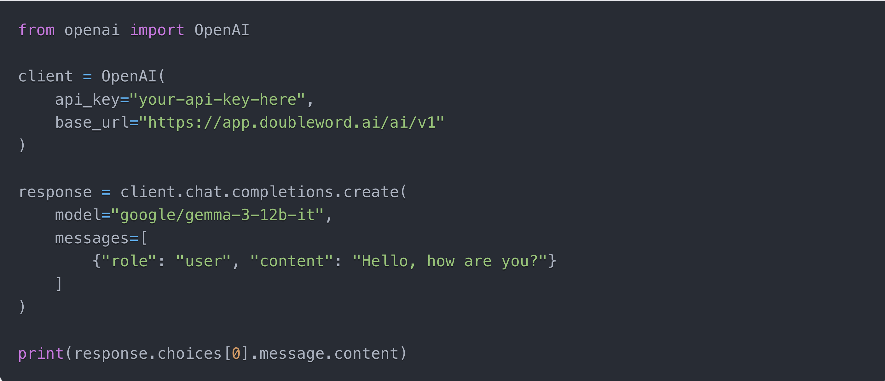
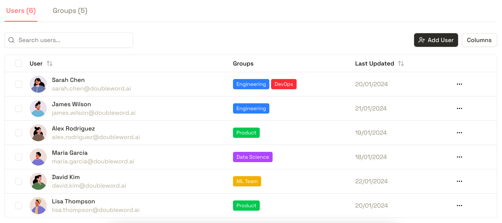
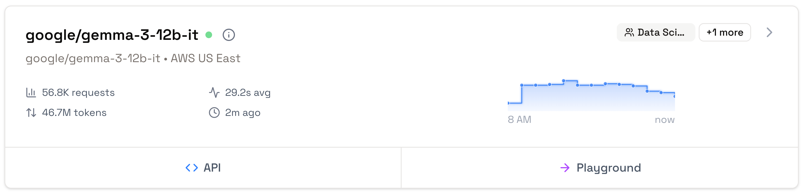
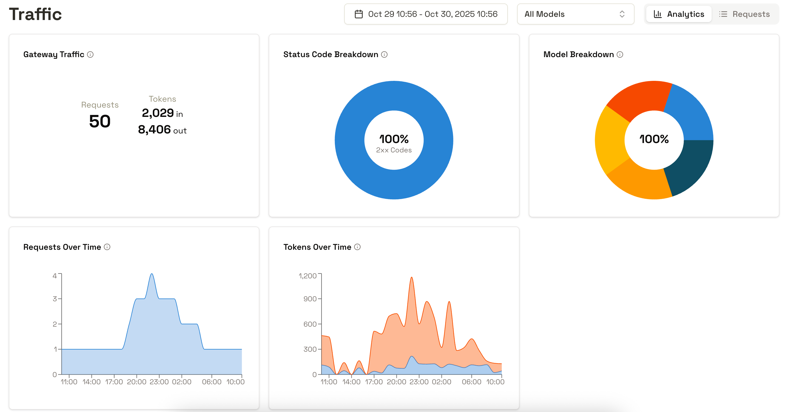
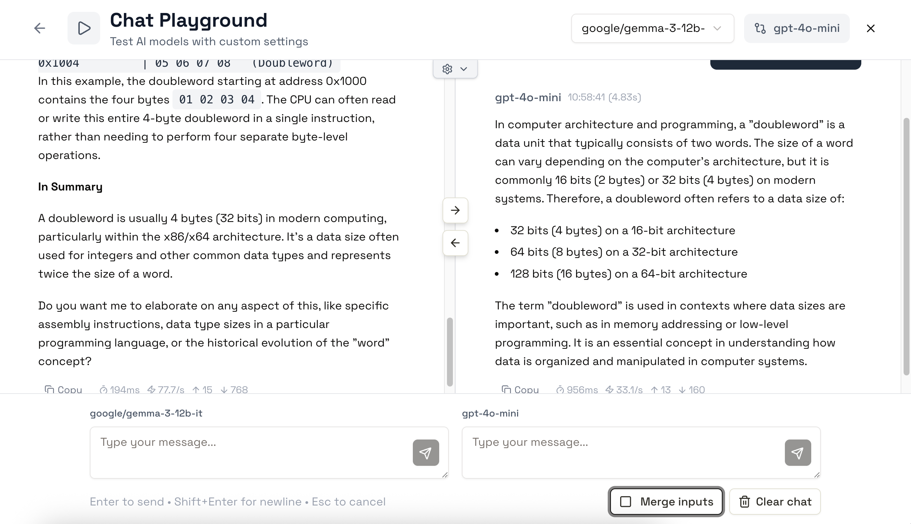

# Control Layer Overview

> Overview of the Doubleword Control Layer, a platform for AI model management with secure and scalable access control.

The Doubleword Control Layer is the world's fastest AI model gateway (450x less overhead than LiteLLM). It provides a single, high-performance interface for routing, managing, and securing LLM inference across model providers, users and deployments - both open-source and proprietary.

> **Why Use the Control Layer?**
>
> Transform your AI infrastructure from scattered API calls to a centralized, secure, and manageable platform that scales with your organization.

## Key Resources

**[GitHub Repo](https://github.com/doublewordai/control-layer)** — Explore the open-source Control Layer code.  
**[Announcement Blog](https://www.doubleword.ai/resources/doubleword-open-sources-the-worlds-fastest-ai-gateway)** — Read the launch announcement and background story.  
**[Demo Video](https://youtu.be/mJoScHrMpHg)** — Watch the Control Layer in action.  
**[CTO Blog](https://fergusfinn.com/blog/control-layer)** — Technical deep dive by Fergus Finn.  
**[Benchmarking Writeup](https://fergusfinn.com/blog/control-layer-benchmarking)** — Performance comparison vs alternatives.

## Key Capabilities

### **OpenAI-Compatible API**

A single OpenAI-compatible gateway to all of your AI models across all your providers. Your existing code works without modification - point your applications to the Control Layer's `/ai/` endpoints and supply a Control Layer API key.

**[Learn more about API access ->](how-to/api.md)**

**[Learn more about adding endpoints ->](how-to/endpoints.md)**

### **Centralized User Management & API Key Authentication**

Manage all the users that can access your AI models from one interface. Map users to groups, let users create their own API keys, and monitor usage across your organization.

The Control Layer turns unauthenticated, self-hosted model deployments into production-ready services with user authentication and access control.

**[Learn more about Users & Groups ->](how-to/users-and-groups.md)**

### **Real-Time Monitoring & Analytics**

Track request volumes, token usage, response times, and model performance across your entire organization. Built-in analytics help you understand usage patterns, optimize costs, and identify bottlenecks.

Drill down into user behaviour across providers - with opinionated analytics for understanding which models are being used, by whom, and for what purposes.

### **Interactive Playground**

Test and compare generative, embedding, and reranker models side-by-side before integrating them into your applications.

## [Get started ->](getting-started.md)
